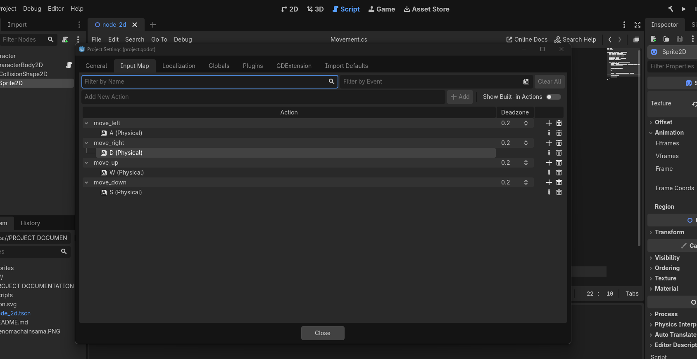
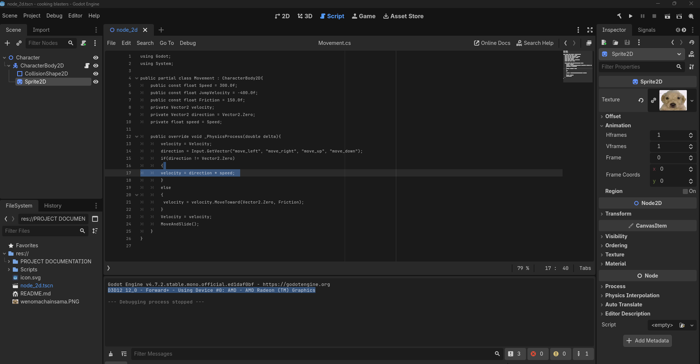

# WEEK 2 

### 1. Core mechanic: 
#### "Running around the map and shooting finished dishes to satisfy customers" 
#### Core Genres 
#### - Rogue Like 
#### - Tower Defense 
#### - RPG 

### 2. Input Mapping 
 ; 

### 3. Player Scene 
; 

### 4. Core Mechanic 
;

### 5. Juice it uppppp  
; 

### 6. Tweak Values 
#### I edited the bullet speed to be 2000 pixels per second, and increased the friction for character movement. 

