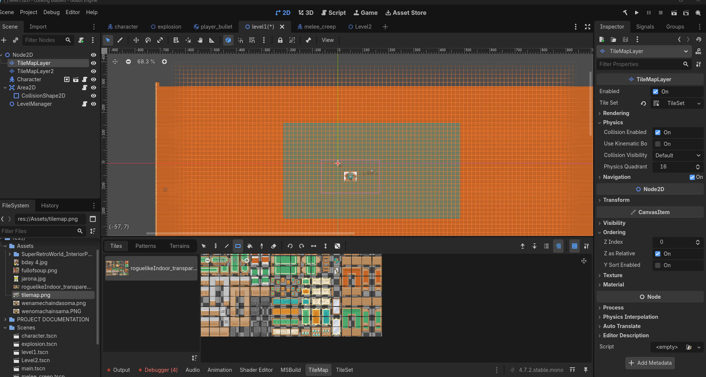
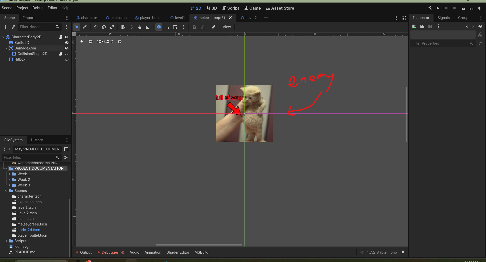
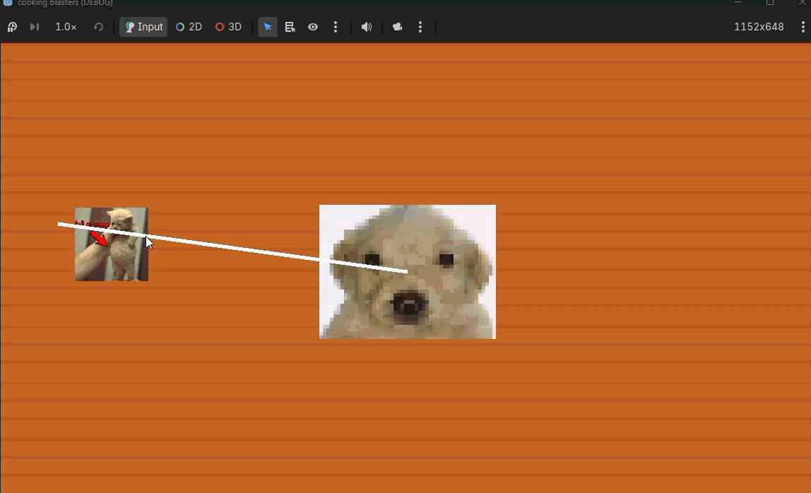
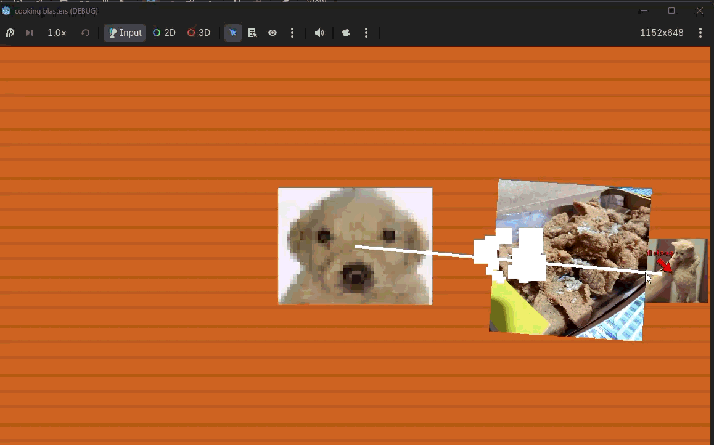

# WEEK 3

### 1. Tileset
 

### 2. Hazards
 ; 

### 3. Levels
; 
;  

### 4. Readability 
#### in this game, the dog's customers will be cats, so the distinction is clear. 

### 5. One Liner Reflection  
#### please refer to my readme :D  

### 6. Level Transitions
;  

