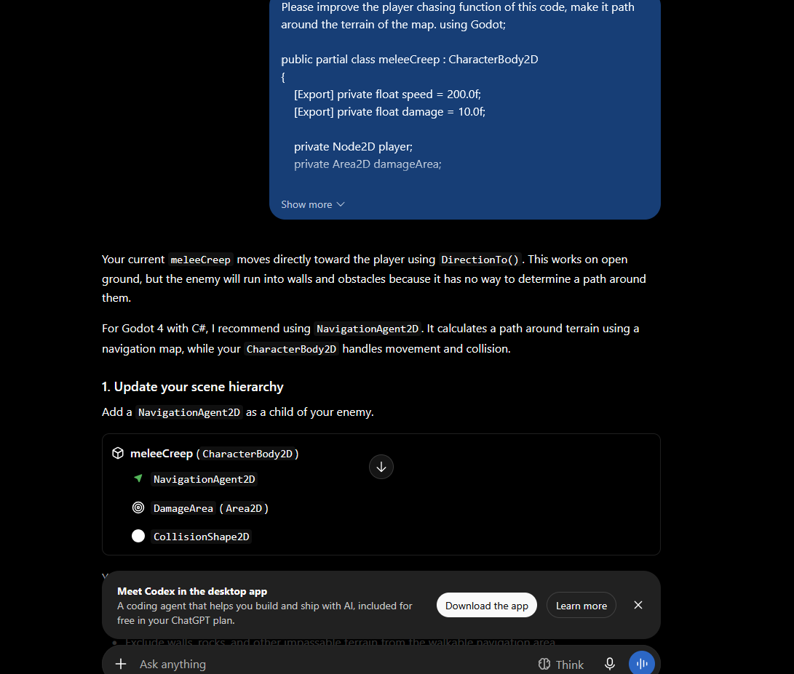
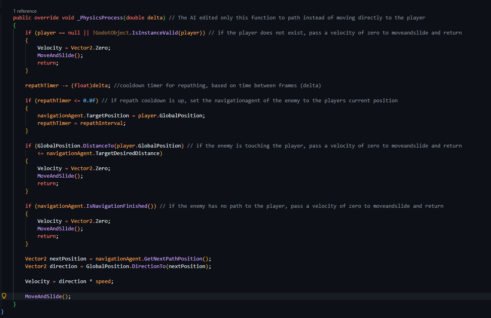
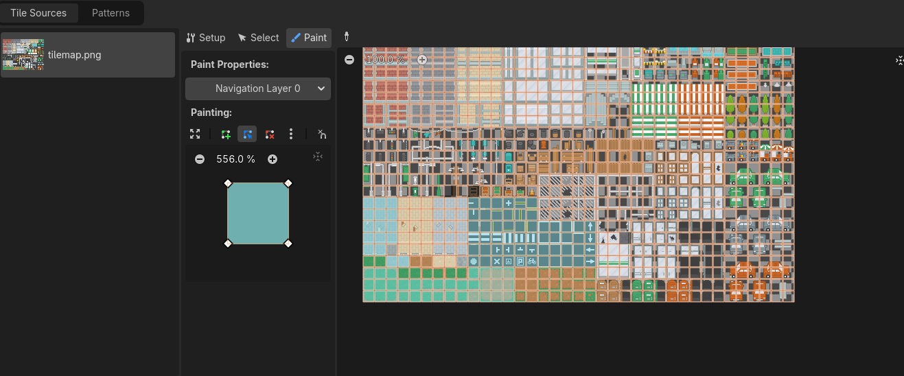

# WEEK 6 

### 1. Define Enemy AI 
#### I want ranged enemies to  shoot the player with 5 damage bullets at a pre-defined interval. 
#### I want the Melee enemies to be able to follow the the player, and path around physics bodies in the map . 

### 2. Prompt for pathing AI 

#### 3. Review Code 

#### In this case, i asked the ai to improve my code. Specifically, i asked it to dynamically path based on the terrain, and thus it used the NavigationAgent2d node to accomplish this. 

### 4. Wire the enemy into the level 

### 5. Debug and tune
#### I adjusted the bullet speed and interval a bit, as they were very fast initially.  

### 6. AIchanges 
#### The AI agent adapted the code mostly to support NavigationAgent2d, to support the navigation mesh i baked into the level. 